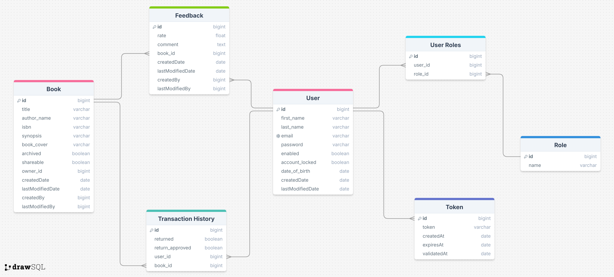
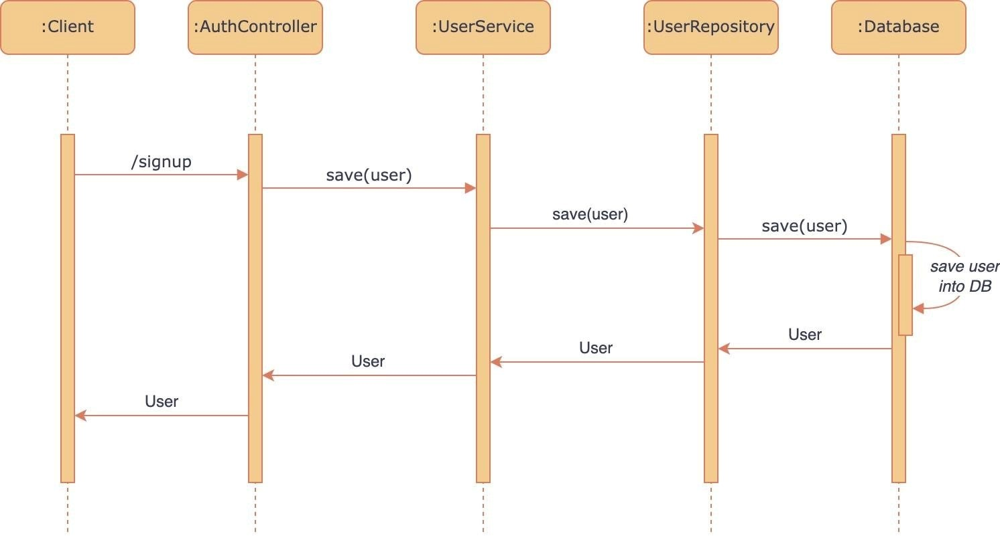
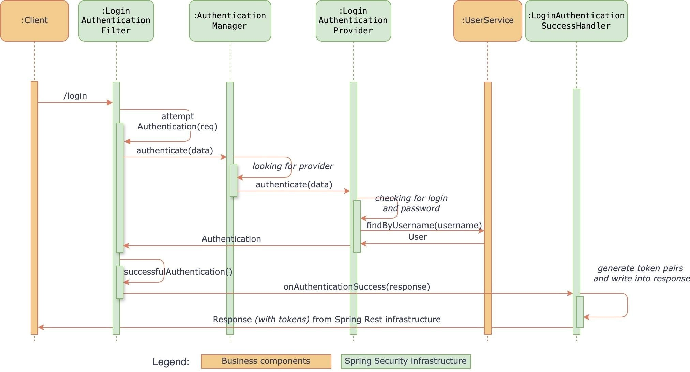
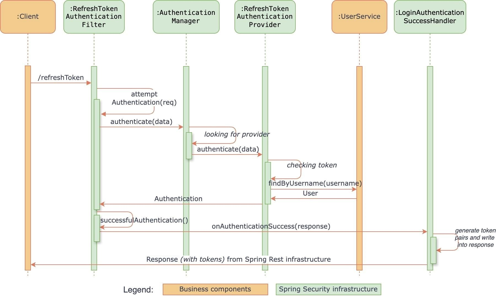

# 📚 Book Social Network 
<!-- [](https://github.com/olexiy/book-social-network/actions/workflows/build-backend.yml)
[](https://sonarcloud.io/summary/new_code?id=olexiy_book-social-network)
[](https://snyk.io/test/github/olexiy/book-social-network) -->

## Table of Contents

- [Overview](#overview)
- [Features](#features)
- [Technologies Used](#technologies-used)
    - [Backend (book-social-network)](#backend-book-social-network)
    - [Frontend (book-social-network-ui)](#frontend-book-social-network-ui)
- [Learning Objectives](#learning-objectives)
- [License](#license)
- [Getting Started](#getting-started)
- [Contributors](#contributors)
- [Acknowledgments](#acknowledgments)

## 📄 Overview

Book Social Network is a full-stack application that enables users to manage their book collections and engage with a community of book enthusiasts. It offers features such as user registration, secure email validation, book management (including creation, updating, sharing, and archiving), book borrowing with checks for availability, book return functionality, and approval of book returns. The application ensures security using JWT tokens, role-based access control and adheres to best practices in REST API design. The backend is built with Spring Boot 3 and Spring Security 6, while the frontend is developed using React and Typescript with Bootstrap for styling. The infrastructure is managed via Docker Compose, and the project follows a mono repo structure for both frontend and backend code.


## ✨ Features

- 📝 User Registration: Users can register for a new account.
- 🔑 Email Validation: Accounts are activated using secure email validation codes.
- 🔐 User Authentication: Existing users can log in to their accounts securely.
- 📚 Book management: creation, updating, sharing, and archiving
- 🔄 Book Borrowing: Implements necessary checks to determine if a book is borrowable.
- ✅ Book Returning: Users can return borrowed books.
- 🔔 Book Return Approval: Functionality to approve book returns.
- ⭐ User feedback and reviews
- 🛠️ Adheres to REST API best practices

<!-- Need to implement Later 
- 🔔 Real-time notifications using WebSocket for updates and interactions
- 📊 **Observability Stack**: Integrated with **Prometheus** for metrics collection, **Tempo** for distributed tracing, **Zipkin** for trace collection, **Loki** for logging, and **Grafana** for visualization and monitoring.
-->


#### **Class Diagram**


#### **Spring Security Diagram**


#### **User Registration Flow**


#### **User Login Flow**


#### **Token Refresh Flow**


#### **Backend Pipeline Flow**


#### **Frontend Pipeline Flow**


## 🛠️ Technology Stack

<p align="left">
  <a href="https://skillicons.dev">
    
  </a>

</p>

### Backend (book-network-backend)

- ☕ Spring Boot 3
- 🔐 Spring Security 6
- 🔑 JWT Token Authentication
- 🗄️ Spring Data JPA
- 🛡️ JSR-303 and Spring Validation
- 📖 OpenAPI and Swagger UI Documentation
- 🐳 Docker and Docker Compose
- ⚙️ GitHub Actions
- 💾 PostgreSQL (Database)
- 📜 JavaMailSender
- 🌀 Maven 

<!-- Need to implement later 
- 🏢 Spring Cloud Netflix Eureka (Service Discovery)
- 🏗️ Spring Cloud Config (Centralized Configuration)
- 🌉 Spring Cloud Gateway (API Gateway)
- 📊 Spring Cloud Zipkin (Tracing and Monitoring)
- 🏘️ Spring Cloud OpenFeign (Declarative REST Client)
- 📡 WebSocket for real-time communication
- 📊 Spring Cloud Zipkin (Tracing and Monitoring)
- 🌀 Tempo (Distributed Tracing)
- 📜 Loki (Log Aggregation)
- 📈 Prometheus (Monitoring and Metrics Collection)
- 📊 Grafana (Data Visualization)
-->


### Frontend (book-network-ui)

- 🌐 React 18 
- ⚙️ TypeScript
- 🎨 Bootstrap for styling
- ⏳ Lazy Loading
- 🔒 Authentication Guard
- 📖 OpenAPI Generator for React

<!-- Need to implement later 
- Figma
- Tailwind
- Material UI
- schdn
- MFA (micro front end application)
- 🔄 rxjs for reactive programming
- 🔌 sockjs-client and stompjs for WebSocket communication
-->


## Learning Objectives

By following this project, I have learnt:

- Designing a class diagram from business requirements
- Implementing a mono repo approach
- Securing an application using JWT tokens with Spring Security
- Registering users and validating accounts via email
- Utilizing inheritance with Spring Data JPA
- Implementing the service layer and handling application exceptions
- Object validation using JSR-303 and Spring Validation
- Handling custom exceptions
- Implementing pagination and REST API best practices
- Using Spring Profiles for environment-specific configurations
- Documenting APIs using OpenAPI and Swagger UI
- Implementing business requirements and handling business exceptions
- Dockerizing the infrastructure
- CI/CD pipeline & deployment


## **System Architecture**  

### **Backend**  
- Built with **Spring Boot**.  
- Implements **Spring Security** for secure authentication.  
- Uses **JWT** for session and token management.  

### **Frontend**  
- Developed with **React** for dynamic and user-friendly UI interactions.  

---
### **System design**

The application will be accessed using a internet browser.  
It was designed under the expectation of a moderate user base for which a single server would be capable of handling the load.

The application is designed in the traditional multilayered architecture consisting of:  
1) Presentation layer (view layer)  
2) Application layer (controller layer)  
3) Domain layer (service layer)  
4) Persistence layer (DAO layer)  
  
The presentation layer contains the user interfaces (UI) for the end users which allow the user to interact with the application.  

The application layer handles and validates the user requests before forwarding them to appropriate services in the domain layer. The application layer also populates the UI for the user.   

The domain layer contains domain specific business logic that is executed on top of domain specific entities in the persistence layer.  

The persistence layer handles all database related operations and serves the domain layer.   

In this design the presentation layer never communicates directly with the persistence layer.
The separation of logical parts avoids tight coupling and promotes reusability.
This design provides separation of concerns and simplicity.  

This design could also be interpreted as a three tiered architecture since we have a presentation tier, a logic tier and a data tier. In the presentation tier each client request always goes through the logic tier which fetches data from the data tier and then updates the presentation tier. 


## **Database and Deployment**  

### **Database**  
- The API uses **PostgreSQL** as the database for storing books, users, and transactions etc. The main entities include:

    - **User** Manages user data, authentication, and email verification status.
    
    - **Role** represets the user roles.

    - **Token** represets the otp token.

    - **Book** represents books in the system with details such as title, author, and cover image.

    - **BorrowTransactionHistory** Tracks borrowing records, including borrow and return dates.

    - **Feedback** Stores user feedback for borrowed books.  

### **Deployment** 
- The project includes Docker and Docker Compose configuration for easy deployment and management.
- All services, including the Spring Boot application and PostgreSQL database, can be run in containers.

**Docker Compose**  
- A `docker-compose.yml` file is included to run the application components.  
- Commands:  
  - Start the application:  
    ```bash  
    docker-compose up -d  
    ```  
  - Stop the application:  
    ```bash  
    docker-compose down  
    ```  


## **DevOps and CI/CD**

I have implemented a Continuous Deployment (CD) pipeline using GitHub Actions to automate the entire process from build to deployment.

### **CD Pipeline Overview**

The pipeline is triggered on:

- Manual dispatch from the GitHub Actions tab
- Pushes to the main branch that include changes in the `book-network-backend/` directory

Key steps in the pipeline:

1. **Environment Setup**:
   - Uses Ubuntu latest as the runner.
   - Sets up JDK 17 with the Temurin distribution.

2. **Docker Integration**:
   - Logs in to Docker Hub using secure credentials.
   - Builds and pushes a Docker image with a unique tag based on the current date and time.

<!-- 3. **AWS Deployment**:
   - Updates the `Dockerrun.aws.json` file with the new Docker image tag.
   - Deploys the application to AWS Elastic Beanstalk.

4. **Version Control**:
   - Commits and pushes the updated `Dockerrun.aws.json` file back to the repository. -->

<!-- 5. **Notifications**:
   - Sends Slack notifications at various stages of the deployment process. -->


## **Getting Started**

To get started with the Book Social Network project, follow the setup instructions in the respective directories:

- [Backend Setup Instructions](/book-network-backend/README.md)
- [Frontend Setup Instructions](book-network-ui/README.md)

## **Contributors**

- [Parth Trivedi](https://github.com/ParthTrivedi2000)

## **Acknowledgments**

- Special thanks to the developers and maintainers of the technologies used in this project. Their hard work and dedication make projects like this possible.


## Contributing

Contributions are welcome! Follow these steps to contribute:
1. Fork the repository.
2. Create a new branch:
   ```bash
   git checkout -b feature/your-feature-name
   ```
3. Commit your changes:
   ```bash
   git commit -m "Add your feature description"
   ```
4. Push to your branch:
   ```bash
   git push origin feature/your-feature-name
   ```
5. Open a Pull Request.
